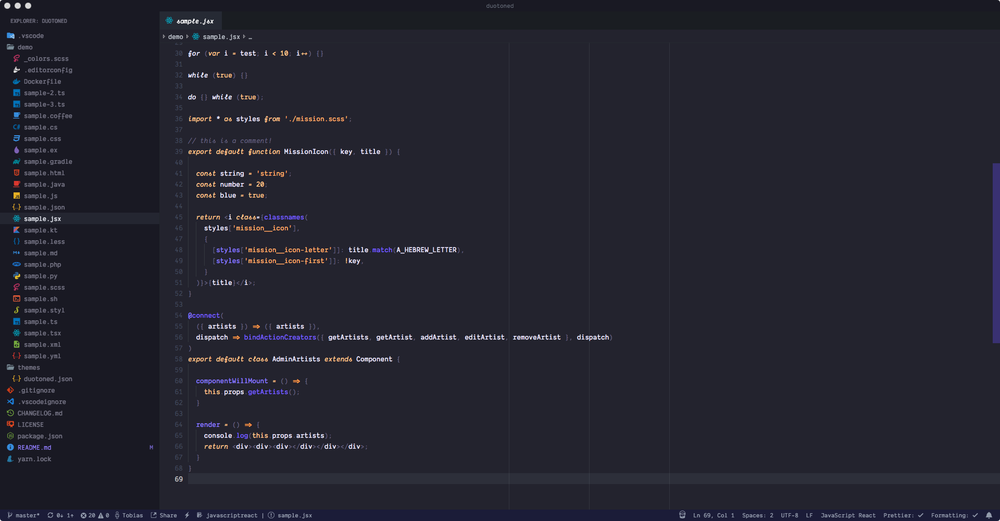

# Duotoned

**Duotoned** is an opinionated version of the duotone syntax for vscode.

This theme is still very WIP. The only supported language is JavaScript at the moment.

Feel free to add your favourite language via a PR.

See the [CHANGELOG](CHANGELOG.md) for the latest changes.

_Icon theme: Material, Font: [Dank Mono](https://dank.sh)_

## Usage

Select the theme and you are ready to go!

## Installation

1.  Open Extensions sidebar panel in VS Code. View → Extensions
1.  Search for `Duotoned`
1.  Click Install
1.  Click Reload
1.  File > Preferences > Color Theme > Duotoned

## Feedback / Issues

Do you like the theme? Don't hesitate to share your thoughts!

Let me know, if you'd like to see any specific synytax added by creating a [Github issue](https://github.com/tobiastimm/duotoned/issues).

## Author

[Tobias Timm](https://twitter.com/TbsTimm)

## License

MIT
